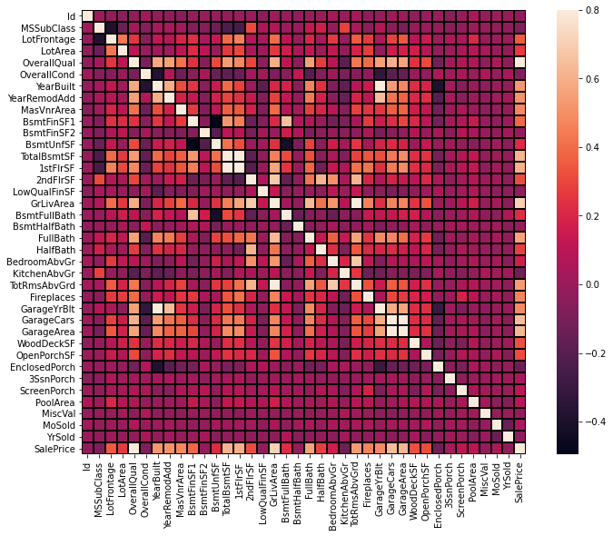

# PREDICTIVE ANALYSIS
Machine Learning: Predicting housing prices using advanced regression technique (Random Forest)

Tools: Python (Numpy, Pandas, Seaborn, Matplotlib, Scikit -learn)

Data Source: Kaggle (training/test data)  
 
 
**CONTENT**
- Exploratory Data Analysis
- Data Cleaning and Feature Selection
- Machine Learning Model Building / Training
- Prediction / Accuracy  

**EXPLORATORY DATA ANALYSIS** 
Before training and testing a machine learning model, it is important to understand the data to be used. This is the purpose of exploratory data analysis. The training dataset consist of 79 explanatory variables and 1 prediction variable (Sale Price) describing every aspect of redsidential homes in Ames, Iowa. By careful examination and preprecessing, relevant features will be selected and used to train model to predict the final selling price of a home. 

I seperated the variables into categorical variable and numerical variables for accurate statistical analysis. A total of 34 numerical and 43 categorical features where classified. 

**MISSING VALUES** 
Missing values where identified in the dataset. For the categorical features, missing values where addressed by assigning 0 to Null values. However, missing values in the categorical variable where replace with the mean value.

**STATISTICAL ANALYSIS AND FEATURE SELECTION**
In other to select the relevant features for prediction, it is important to identity features that have a strong correlation with housing sale price. For the numerical variables, this was done by using a pearson correlation heatmap.

Visualizing the correlation between the numerical features and sales price using a correlation plot, I observed 10 numerical variables with a correlation of at least 0.5 with housing sale price.

|Features | Correlation |
| ------- | ----------- |
|OverallQual | 0.790982 |
|GrLivArea | 0.708624 |
|GarageCars | 0.640409 |
|GarageArea | 0.623431 |
|TotalBsmtSF | 0.613581 |
|1stFlrSF | 0.605852 |
|FullBath |  0.560664 |
|TotRmsAbvGrd | 0.533723 |
|YearBuilt | 0.522897 |
|YearRemodAdd |0.507101|

Overall material and finish of the house has the highest correlation. This makes alot of sense because houses with higher quality finishes will cost more. The next feature with high correlation is the above ground living area. This features relates the size of the house which will difinitely influence sales price.
